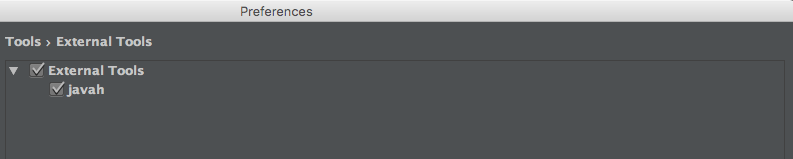
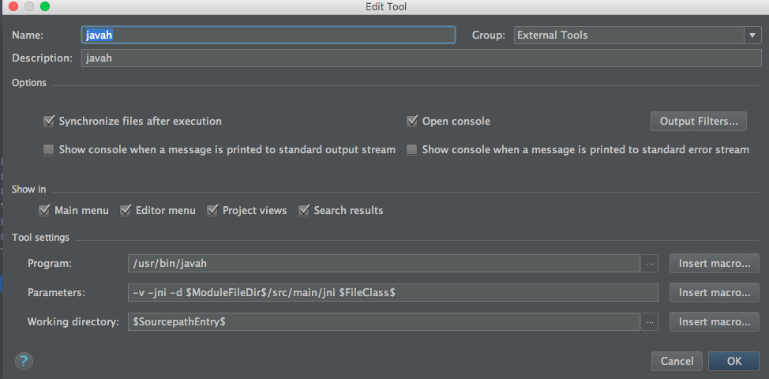

# JNIDemo

一直以来，都觉得Java和Native C的通信没有比较全面直观的教程，知道前几天看见一个大牛的总结。所以接着这个机会，对JNI调用做一些简单记录：
	
* JNI的两种注册机制
* 较大型项目JNI的开发框架

### JNI
JNI是Java和C进行混合编程的桥梁，其中的核心点就是在Java层声明的Native方法，如何在C层中找到对应的实现。
 	
1. 静态注册		
2. 动态注册，需要提供Java中Native方法的方法签名和Native层中对应的实现函数。
	

#### 静态注册
要求C/C++层的函数名符合某种特定的要求:
	
* 包含Java中Native方法的目录信息和方法名

举个栗子：
假如以下是StaticTest.java 类代码：
	
	package jnicourse.hhx.com.jnidemo;

	/**
 	* Created by CodeYel on 16/9/17.
 	*/
	public class StaticTest {
  	  	public native int doAdd(int param1,int param2);
	}
	
这对应的C++中jnicourse_hhx_com_jnidemo_StaticTest.h的函数名是：
	
	/*
 	* Class:     jnicourse_hhx_com_jnidemo_StaticTest
 	* Method:    doAdd
 	* Signature: (II)I
 	*/
	JNIEXPORT jint JNICALL Java_jnicourse_hhx_com_jnidemo_StaticTest_doAdd (JNIEnv *, jobject, jint, jint);
	
按照以上规则进行命名就，在调用到Native的方法时,JVM会去查找是否存在对应函数名的函数，以此实现静态注册。

附带礼品：NDK提供了javap命令来方便根据.java文件来生成.h。
假如你使用AS作为你的IDE，你可以自定义扩展工具，如下图所示：

使用方法：在包含Native声明的方法的文件上右键，选择External Tool中的Javap工具。

#### 动态注册
动态注册相对于静态注册，优点是不再根据特定路径查找函数的实现，带来两个好处：

1. 没有了冗杂的函数名，适用于大型项目开发。
2. 由于不再根据Native函数查找对应的jni层函数，所以首次调用速度比静态注册快。

开发者需要自行提供Java层和C/C++层中的映射关系。

一种可行的方法是基于JNI重载JNI_OnLoad()，在其中对函数进行动态注册。

举个🌰：

DynamicTest.java
	
	package jnicourse.hhx.com.jnidemo;

	/**
	 * Created by CodeYel on 16/9/17.
	 */
	public class DynamicTest {
	    public native int doTwo(int param1, int param2);
	}

	
DynamicBind.cpp	

1. 以下三个部分完成了对方法的动态注册任务。此步骤涉及到如何获取Java函数的函数问题。具体请查看文末的参考文献，点击此[Link](http://zhixinliu.com/2015/07/01/2015-07-01-jni-register/)。
	
	static const char *className = "jnicourse/hhx/com/jnidemo/DynamicTest";

	static JNINativeMethod gJni_Methods_DynamicTest[] = {
        {"doTwo", "(II)I", (void*)addTwoNumber},
	};
	
	static int jniRegisterNativeMethods(JNIEnv* env, const char* className, const JNINativeMethod* gMethods, int numMethods)
	{
    	jclass clazz;

  		 clazz = (env)->FindClass( className);
   		 if (clazz == NULL) {

        	return -1;
    	}
    	int result = 0;
    	if ((env)->RegisterNatives(clazz, gMethods, numMethods) < 0) {

    	    result = -1;
    	}
    	(env)->DeleteLocalRef(clazz);
    	return result;
	}
	
2. 重载JNI_OnLoad函数，并在其中调用jniRegisterNativeMethods函数

		jint JNI_OnLoad(JavaVM* vm, void* reserved){

   	 	JNIEnv* env = NULL;
    	jint result = -1;

    	if (vm->GetEnv((void**) &env, JNI_VERSION_1_4) != JNI_OK) {
        	return result;
    	}

	   	jniRegisterNativeMethods(env, className, gJni_Methods_DynamicTest, sizeof(gJni_Methods_DynamicTest) / sizeof(JNINativeMethod));

    	return JNI_VERSION_1_4;
		}
		
		
PS：在函数返回值方面，可以做一些定制，来根据返回值判断调用jniRegisterNativeMethods是否成功。

### JNI开发工具
结构如下：

#### 动态注册框架
主要由：JniHelper.h和JniHelper.cpp构成。

是上文介绍的动态注册方法做了一个简单的封装，具体请看DEMO中的DynamicBind2.h和DynamicBind2.cpp文件实现。

使用方法：

1. 在需要动态注册的文件中，引入

		#include "util/JniHelper.h"
	
2. 定义一个函数进行注册：

		jint register_DT2(JNIEnv * env) {
    		return jniRegisterNativeMethods(env, className2, gJni_Methods_DynamicTest2, NELEM(gJni_Methods_DynamicTest2));
		}
	
3. 在上文的JNI_OnLoad函数进行调用register_DT2函数。

#### Log框架
主要由：JniDebug.h和JniDebug.cpp构成。
做了一个简单的实现，具体请看文末贴出的文本DEMO的链接。

注意在Android.mk文件中添加以下语句：

	LOCAL_LDLIBS += -L$(SYSROOT)/usr/lib -llog
	
	
#### 注意事项

1. 在Android.mk中的添加.cpp文件。

	例如以下代码将dynamic，static，util目录下的cpp文件引入。
	
		FILE_LIST := $(wildcard $(LOCAL_PATH)/dynamic/*.cpp) \
 		$(wildcard $(LOCAL_PATH)/static/*.cpp) \
 		$(wildcard $(LOCAL_PATH)/util/*.cpp)
		LOCAL_SRC_FILES :=$(FILE_LIST:$(LOCAL_PATH)/%=%)
		
### 参考文献
 1. 很棒的文章，推荐。另外已经和此文作者进行Email沟通。[http://zhixinliu.com/2015/07/01/2015-07-01-jni-register/](http://zhixinliu.com/2015/07/01/2015-07-01-jni-register/)
 2. 介绍了一种使用实验性的Gradle进行开发的方法。[https://github.com/freekite/Android-JNITest](https://github.com/freekite/Android-JNITest)
 3. 一篇比较详细的JNI文章。[https://my.oschina.net/wolfcs/blog/111309](https://my.oschina.net/wolfcs/blog/111309)
 
